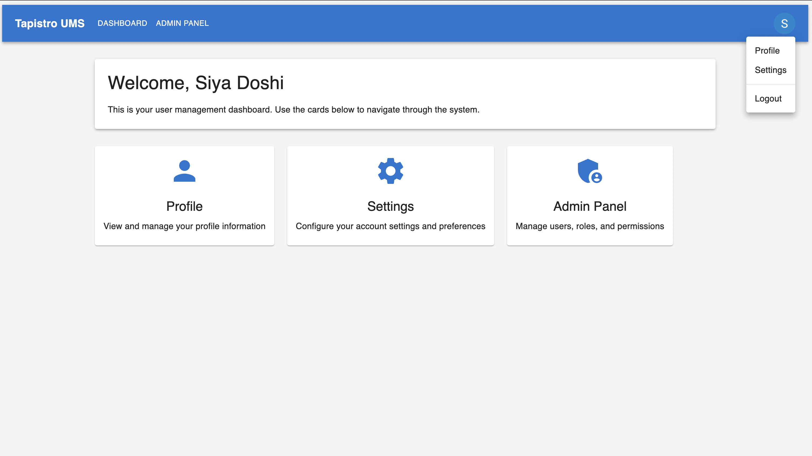

# Tapistro UMS

A comprehensive User Management System built with React (Vite), Node.js, and MySQL, featuring Google authentication and role-based access control.

## Features

- **Google Authentication** - Secure login with Google OAuth 2.0
- **Role-Based Access Control** - Admin and User role permissions
- **User Management** - Add, edit, and remove users with different roles
- **Responsive Design** - Works seamlessly on desktop and mobile devices
- **Dark/Light Mode** - Customizable UI theme for better user experience

## Screenshots

## Screenshots


*Login page with Google authentication*


*User dashboard after successful authentication*


*Admin panel for managing users and roles*


*Role assignment interface*


*Permissions management section*


*User settings panel*


*Responsive mobile layout*


## Tech Stack

- **Frontend**: React 18 with Vite, Material UI 5
- **Backend**: Node.js, Express
- **Database**: MySQL
- **Authentication**: Google OAuth 2.0, JWT

## Application Workflow

### Authentication Flow

1. User navigates to the login page
2. User clicks on "Sign in with Google" button
3. After successful authentication, the user is redirected to the dashboard
4. The system automatically assigns roles based on email (admin for pre-configured emails)

### User Management (Admin Only)

1. Admin users can view a list of all registered users
2. Admins can add new users manually
3. Admins can edit user details and assign/remove roles
4. Admins can delete users

## Installation and Setup

### Prerequisites

- Node.js (v14 or later)
- MySQL (v8 or later)
- Google OAuth credentials

### Backend & Frontend Setup

```bash
# Clone the repository
git clone https://github.com/yourusername/tapistro-ums.git

# Navigate to backend directory
cd tapistro-ums/backend

# Install dependencies
npm install

# Configure environment variables
cp .env.example .env
# Edit .env with your database and Google OAuth credentials

# Start the server
npm start

# Navigate to frontend directory
cd ../frontend-vite

# Install dependencies
npm install

# Start the development server
npm run dev
